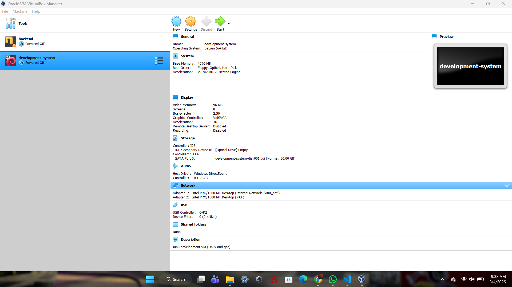
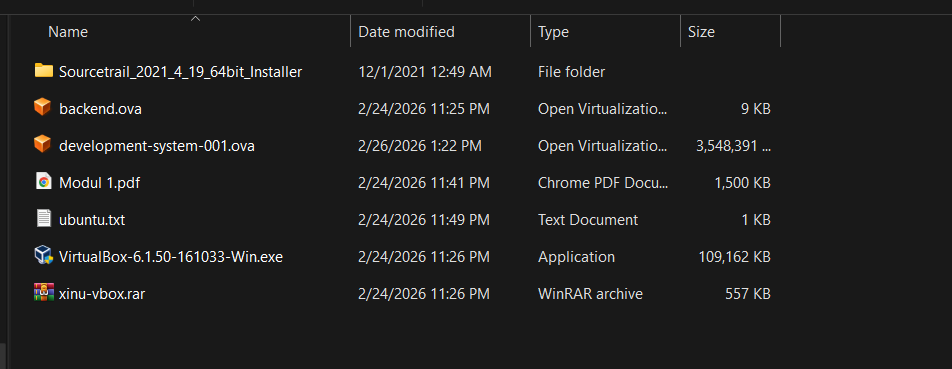

# <h1 align="center">Laporan Praktikum Modul 1   Instalasi dan Pengenalan Tools Praktikum</h1>

Farrel Izaz Yuwono - 2311104014

---

## Dasar Teori

Pada praktikum Sistem Operasi ini, praktikan menggunakan beberapa tools pendukung untuk melakukan simulasi dan eksplorasi sistem berbasis virtual. Salah satu tools utama yang digunakan adalah Oracle VM VirtualBox, yaitu perangkat lunak virtualisasi yang memungkinkan pengguna menjalankan sistem operasi lain di dalam sistem operasi utama (host). Dengan VirtualBox, praktikan dapat membuat mesin virtual (virtual machine) tanpa perlu mengubah konfigurasi sistem utama.

Sistem operasi yang digunakan dalam praktikum ini adalah Ubuntu, sebuah distribusi Linux berbasis Debian yang bersifat open-source dan banyak digunakan untuk pembelajaran maupun pengembangan sistem. Ubuntu dijalankan di dalam VirtualBox sebagai guest operating system.

Selain itu, digunakan juga Xinu OS (Xinu Is Not Unix), yaitu sistem operasi edukatif yang dikembangkan untuk tujuan pembelajaran konsep dasar sistem operasi seperti manajemen proses, manajemen memori, sistem berkas, dan interrupt handling.

Tools tambahan yang digunakan adalah Sourcetrail, yaitu software untuk melakukan analisis dan visualisasi source code sehingga memudahkan dalam memahami struktur program.

Penggunaan virtualisasi dalam praktikum ini bertujuan untuk menciptakan lingkungan yang aman dan terisolasi, sehingga kesalahan konfigurasi atau eksperimen yang dilakukan tidak memengaruhi sistem operasi utama pada komputer laboratorium.

---

## Guided

### 1. Verifikasi Instalasi Tools
Pastikan tools berikut telah terinstall pada komputer:
- Oracle VM VirtualBox (versi 6.1)
- File Xinu (format .ova) tersimpan di direktori
- Ubuntu sudah tersedia pada VirtualBox
- Sourcetrail telah terinstall

---

### 2. Menjalankan VirtualBox
1. Buka aplikasi VirtualBox.
2. Pastikan mesin virtual Ubuntu tersedia pada daftar VM.

   

   

---

### 3. Menjalankan Ubuntu
1. Pilih mesin virtual Ubuntu.
2. Klik tombol **Start**.

   

---

### 4. Memastikan File Xinu
1. Buka File Explorer.
2. Periksa direktori `C:/`.
3. Pastikan file Xinu (.ova) sudah tersedia.

   

   

---

### 5. Membuka Sourcetrail
1. Jalankan aplikasi Sourcetrail.
2. Pastikan aplikasi dapat terbuka tanpa error.

   

   

---

## Kesimpulan

Berdasarkan praktikum yang telah dilakukan, dapat disimpulkan bahwa seluruh tools yang dibutuhkan untuk praktikum telah berhasil terinstall dan dapat dijalankan dengan baik. Lingkungan virtual menggunakan VirtualBox dan Ubuntu telah siap digunakan untuk modul selanjutnya, termasuk proses instalasi dan konfigurasi Xinu OS.

---

## Referensi

1. https://en.wikipedia.org/wiki/Data_structure
2. https://www.virtualbox.org/
3. https://ubuntu.com/
4. https://www.cs.purdue.edu/homes/comer/downloads/Xinu_Book_And_Code/
5. https://github.com/CoatiSoftware/Sourcetrail