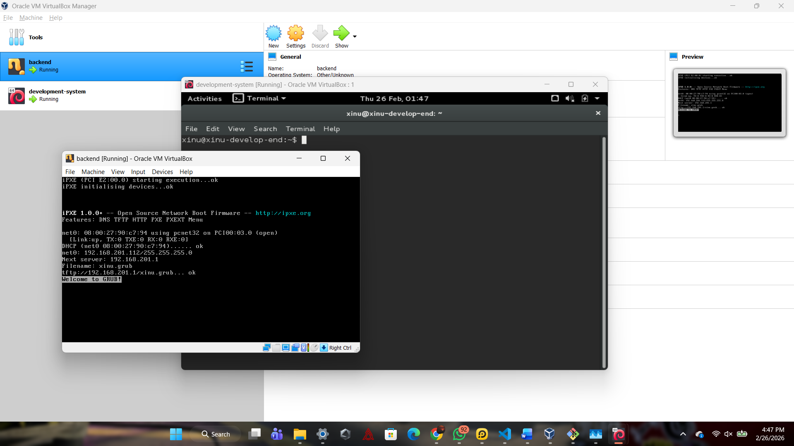

# <h1 align="center">Laporan Praktikum Modul 2   Pengenalan Praktikum Sistem Operasi & Setup Environment</h1>

Farrel Izaz Yuwono - 2311104014

---

## Dasar Teori

Sistem Operasi (Operating System) adalah perangkat lunak yang berfungsi sebagai penghubung antara pengguna (user) dan perangkat keras (hardware). Sistem operasi bertanggung jawab dalam mengelola sumber daya komputer seperti:

- Manajemen Proses
- Manajemen Memori
- Sistem Berkas (File System)
- Manajemen Perangkat I/O
- Penjadwalan CPU (Scheduling)

Dalam praktikum ini digunakan metode **virtualisasi**, yaitu menjalankan sistem operasi di dalam sistem operasi utama menggunakan Virtual Machine. Virtualisasi memungkinkan pengguna melakukan eksperimen tanpa mengganggu sistem utama komputer.

Software virtualisasi yang digunakan adalah **Oracle VM VirtualBox**, yang memungkinkan menjalankan sistem operasi seperti Ubuntu dan Xinu dalam bentuk file `.ova`.

Xinu (Xinu Is Not Unix) merupakan sistem operasi pembelajaran yang digunakan untuk memahami konsep dasar perancangan sistem operasi seperti manajemen proses dan penjadwalan.

---

## 🛠 Tools yang Digunakan (Berdasarkan Source)

Berikut file yang tersedia pada komputer praktikum:

### 1️⃣ VirtualBox

Digunakan untuk membuat dan menjalankan Virtual Machine.

Langkah:
- Jalankan installer
- Install hingga selesai
- Buka VirtualBox

---

### 2️⃣ Development System

Digunakan sebagai environment utama praktikum (Ubuntu + Xinu Environment).

Cara Import:
1. Buka VirtualBox
2. Klik **File → Import Appliance**
3. Pilih `development-system-001.ova`
4. Klik **Next → Import**
5. Jalankan VM

Login: xinurocks

---

### 3️⃣ Backend VM

Digunakan untuk kebutuhan modul tertentu sesuai arahan Asisten Praktikum.

Import dengan cara:

Langkah:
1. Extract file `xinu-vbox.rar`
2. Import file `.ova` ke VirtualBox
3. Xinu akan digunakan pada modul berikutnya

---

### 5️⃣ Sourcetrail

Digunakan untuk visualisasi source code agar memudahkan pemahaman struktur program.

Langkah:
- Buka folder installer
- Jalankan installer
- Install hingga selesai

---

## 🧪 Guided / Langkah Praktikum

### 1️⃣ Instalasi VirtualBox
- Jalankan file installer
- Pastikan instalasi berhasil
- Buka aplikasi VirtualBox

📸 Screenshot yang dikumpulkan:
- Proses instalasi
- Tampilan awal VirtualBox

---

### 2️⃣ Import Development System
- File → Import Appliance
- Pilih `development-system-001.ova`
- Klik Import
- Jalankan VM
- Login menggunakan password: `xinurocks`

📸 Screenshot:
- Proses import
- Tampilan login
- Desktop Ubuntu setelah berhasil masuk

---

### 3️⃣ Verifikasi Tools
Pastikan:
- VM dapat berjalan tanpa error
- Ubuntu berhasil login
- File Xinu tersedia
- Sourcetrail terinstall

---

## 📚 Referensi

1. https://www.virtualbox.org/  
2. https://ubuntu.com/

---