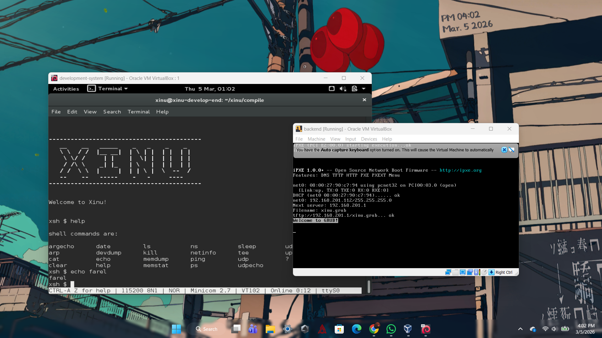

# <h1 align="center">Laporan Praktikum Modul 3 <br> Eksplorasi Xinu</h1>
<p align="center">Farrel Izaz - 2311104014</p>

---

## Dasar Teori

Sistem operasi merupakan perangkat lunak yang berfungsi sebagai penghubung antara perangkat keras komputer dengan pengguna. Sistem operasi bertugas mengatur sumber daya komputer seperti CPU, memori, perangkat input/output, serta menyediakan layanan bagi program aplikasi. Dalam proses pembelajaran sistem operasi, sering digunakan sistem operasi khusus yang dirancang untuk tujuan edukasi agar mahasiswa dapat memahami konsep dasar sistem operasi secara lebih mudah.

Salah satu sistem operasi yang digunakan untuk pembelajaran adalah Xinu (Xinu Is Not Unix). Xinu merupakan sistem operasi yang dirancang oleh Douglas Comer dari Purdue University untuk tujuan pendidikan. Xinu digunakan untuk mempelajari berbagai konsep penting dalam sistem operasi seperti manajemen proses, manajemen memori, komunikasi antar proses, serta mekanisme interrupt.

Dalam praktikum ini, Xinu dijalankan menggunakan lingkungan virtualisasi. Virtualisasi memungkinkan beberapa sistem operasi dijalankan dalam satu komputer fisik menggunakan mesin virtual. Salah satu software virtualisasi yang digunakan adalah Oracle VM VirtualBox. Dengan menggunakan VirtualBox, praktikan dapat menjalankan beberapa mesin virtual seperti development-system VM dan backend VM tanpa mempengaruhi sistem operasi utama pada komputer.

Selain itu, dalam proses menjalankan Xinu diperlukan proses kompilasi. Kompilasi adalah proses mengubah source code menjadi file executable atau image yang dapat dijalankan oleh sistem komputer. Pada praktikum ini proses kompilasi dilakukan menggunakan tool bernama make. Tool ini membantu mengelola proses kompilasi berbagai file source code secara otomatis.

Untuk berkomunikasi dengan sistem operasi Xinu digunakan aplikasi bernama Minicom. Minicom merupakan program terminal berbasis Linux yang digunakan untuk berinteraksi melalui serial port. Serial port virtual digunakan sebagai media komunikasi antara development-system VM dengan backend VM sehingga perintah yang diketik pada terminal dapat dikirimkan ke sistem operasi Xinu untuk dijalankan.

Dengan melakukan eksplorasi terhadap Xinu, praktikan dapat memahami bagaimana sebuah sistem operasi dijalankan, bagaimana proses kompilasi dilakukan, serta bagaimana komunikasi antara sistem operasi dengan pengguna melalui shell.

---

## Guided

### 1. Menjalankan Development-System VM
1. Jalankan VirtualBox.
2. Klik **Start** pada mesin virtual **development-system**.
3. Login menggunakan akun berikut:
   - **username:** `xinu`
   - **password:** `xinurocks`


---

### 2. Membuka Terminal

Setelah berhasil login, akan muncul terminal Linux yang digunakan untuk menjalankan berbagai perintah pada sistem.

Pada terminal ini praktikan dapat memberikan perintah kepada sistem komputer. Contoh perintah yang dapat digunakan adalah `halt` yang berfungsi untuk mematikan sistem komputer.


---

### 3. Berpindah ke Direktori Xinu

Pada terminal ketikkan perintah berikut:

```bash
cd xinu/compile
```

