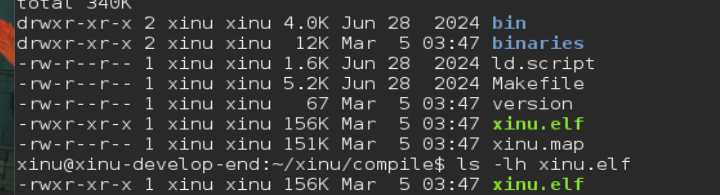
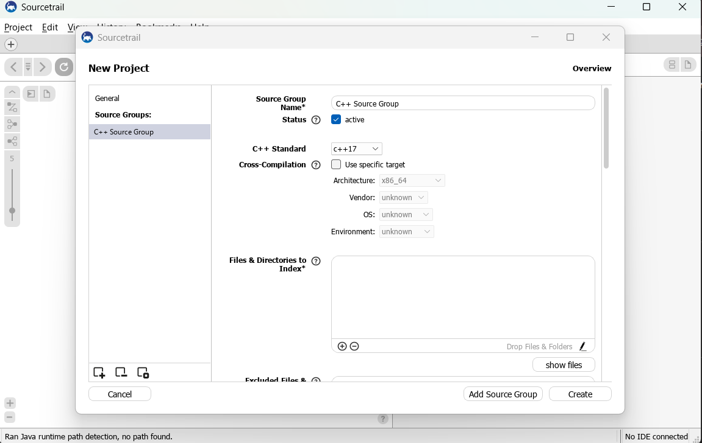
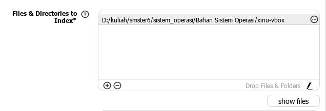
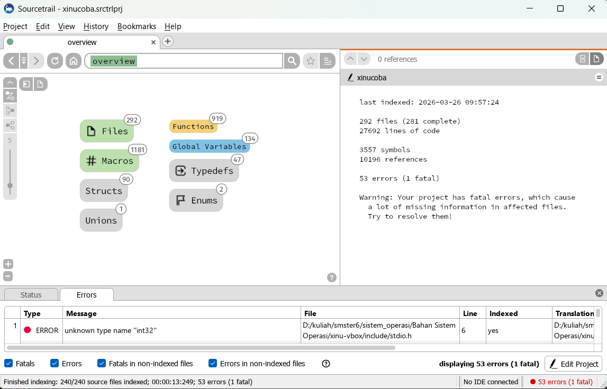
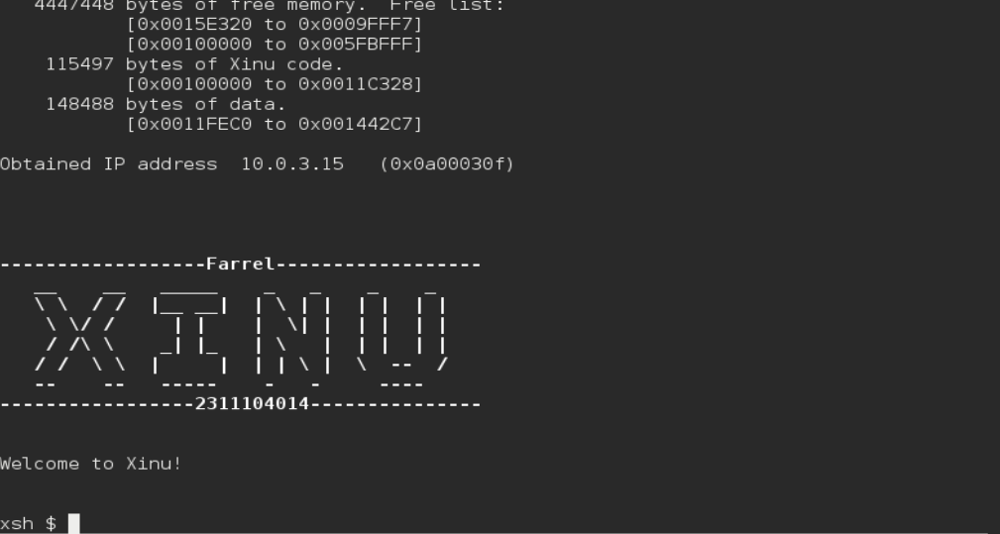

# Praktikum Xinu
Farrel Izaz Yuwono - 2311104014

Praktikum Sistem Operasi – Eksplorasi dan Modifikasi Xinu OS

---

## Dasar Teori
Xinu adalah sistem operasi sederhana yang digunakan untuk mempelajari konsep dasar sistem operasi seperti manajemen proses, memori, dan interaksi dengan hardware. Pada praktikum ini dilakukan eksplorasi source code serta modifikasi sederhana pada sistem.

---

## Tugas

### 1. Informasi Image Xinu (10 Poin)
- Apa nama image hasil kompilasi Xinu?
- Berapa ukuran file tersebut?
- Ada di folder mana file tersebut?

---

### 2. Membaca Source Code Xinu

Langkah-langkah:

1. Cek aplikasi Sourcetrail di PC  
   Jika belum ada, download dan install

2. Download source code Xinu dari LMS

3. Jalankan Sourcetrail

4. Buat project baru:
   - Project → New Project
   - Nama project: xinu
   - Pilih lokasi project

 

5. Add Source Groups:
   - Pilih C
   - Pilih Empty C Source Group

 

6. File & Directories to Index:
   - Masukkan semua folder Xinu yang sudah didownload

    

7. Include Paths: D:\kuliah\smster6\sistem_operasi\Bahan Sistem Operasi\xinu-vbox\include

8. Klik Create
9. Eksplorasi source code

---

### 3. Struktur Data Proses Xinu (10 Poin)

- **Nama struktur data**: `procent`
- **File lokasi**: `process.h` (di folder `xinu/include`)

#### Informasi yang disimpan:
- prstate → Status proses (running, ready, sleep, dll)
- prprio → Prioritas proses
- prstkptr → Pointer stack saat ini
- prstkbase → Alamat awal stack
- prstklen → Ukuran stack (byte)
- prname → Nama proses
- prsem → Semaphore yang sedang ditunggu
- prparent → ID proses yang membuat proses ini
- prmsg → Pesan yang dikirim ke proses
- prhasmsg → Penanda apakah ada pesan
- prdesc[] → Descriptor device yang digunakan proses

---

### 4. Modifikasi Welcome Banner (80 Poin)

