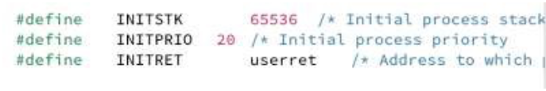
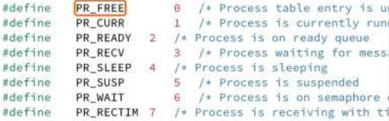
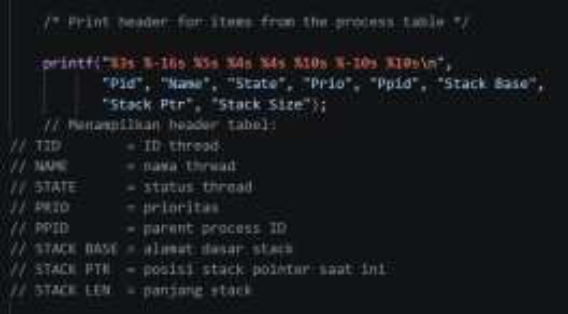
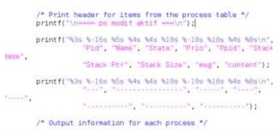
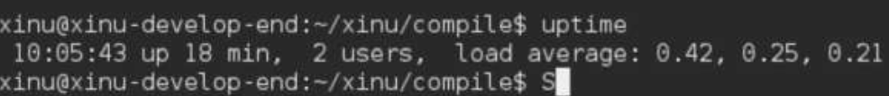

# Laporan Praktikum Modul 05

## Eksplorasi Proses pada Xinu

**Farrel Izaz Yuwono – NIM 2311104014**

---

## Dasar Teori

Dalam sistem operasi, proses merupakan program yang sedang dieksekusi oleh CPU. Setiap proses memiliki atribut dan informasi penting yang disimpan dalam suatu struktur data yang disebut Process Control Block (PCB). PCB berisi data seperti process ID, status proses (state), prioritas, register CPU, serta informasi komunikasi antar proses seperti pesan.

Pada sistem operasi Xinu, manajemen proses dilakukan secara sederhana namun cukup representatif untuk memahami konsep dasar sistem operasi. Xinu menyediakan beberapa status proses seperti running, ready, dan waiting, serta menggunakan mekanisme penjadwalan berbasis prioritas.

Selain itu, Xinu juga mendukung komunikasi antar proses melalui mekanisme message passing, di mana setiap proses dapat mengirim dan menerima pesan. Informasi ini dapat diamati melalui perintah seperti `ps`, yang menampilkan kondisi proses yang sedang berjalan.

Pemahaman terhadap struktur PCB, status proses, serta kemampuan untuk memodifikasi perintah sistem seperti `ps` dan `uptime` menjadi bagian penting dalam mempelajari bagaimana sistem operasi bekerja secara internal.

---

## Tujuan

1. Memahami konsep Process Control Block (PCB) pada sistem operasi Xinu.
2. Mampu melakukan perubahan sederhana terhadap proses dalam Xinu.

---

## Catatan

1. Praktikan diwajibkan untuk mengambil screenshot pada setiap tahapan pengerjaan hingga hasil akhir ditampilkan.
2. Untuk bagian kode program, cukup lampirkan dalam bentuk screenshot.
3. Screenshot harus menampilkan identitas root, misalnya: `root@username`.
4. Cantumkan nama dan NIM dalam bentuk komentar pada source code.
5. Praktikum harus dikerjakan secara individu. Jika mengalami kesulitan, silakan bertanya kepada asisten praktikum.
6. Dilarang menyalin jawaban maupun kode dari praktikan lain.

---

## Jurnal

### 1. Jawaban Pertanyaan

#### a. Jumlah maksimum proses pada Xinu

**Jawab:**
8

---

#### b. Panjang maksimum nama proses

**Jawab:**
16

---

#### c. Nilai prioritas awal proses

**Jawab:**
20

---

#### d. Jumlah total state pada Xinu

**Jawab:**
8

---

### 2. Modifikasi Source Code ps

Perintah `ps` digunakan untuk menampilkan informasi proses yang sedang berjalan. Source code dari perintah ini berada pada file `xsh_ps.c`. Pada praktikum ini dilakukan penambahan komentar pada 20 baris terakhir dari file tersebut.

**Jawab:**

---

### 3. Modifikasi Perintah ps

Dilakukan perubahan pada file `xsh_ps.c` untuk menambahkan kolom baru yang menampilkan jumlah pesan dan isi pesan pada setiap proses.

Keterangan:

* Kolom Msg → jumlah pesan dalam proses
* Kolom Content → isi pesan

#### Source Code

#### Output

---

### 4. Modifikasi Perintah uptime

Perintah `uptime` dimodifikasi agar hanya menampilkan lama waktu sistem berjalan dalam satuan menit sejak booting.

#### Source Code

#### Output

---
