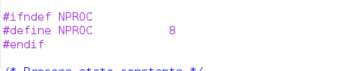
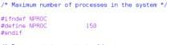
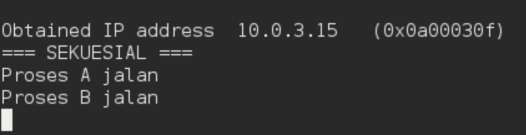
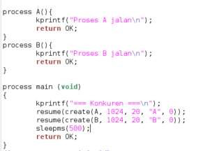

# Laporan Praktikum Modul 06

## Proses Sekuensial dan Konkuren

**Farrel Izaz Yuwono – NIM 2311104014**

---

## Dasar Teori

Dalam sistem operasi, eksekusi proses dapat dilakukan secara sekuensial maupun konkuren. Proses sekuensial adalah proses yang dijalankan secara berurutan, di mana satu proses harus selesai terlebih dahulu sebelum proses berikutnya dimulai. Model ini sederhana dan mudah dipahami karena alur eksekusinya terstruktur.

Sebaliknya, proses konkuren memungkinkan beberapa proses berjalan secara bersamaan (atau seolah-olah bersamaan), tergantung pada mekanisme penjadwalan CPU. Pada sistem seperti Xinu, concurrency dicapai melalui pembagian waktu CPU (time sharing), sehingga beberapa proses dapat bergantian menggunakan CPU dalam waktu yang sangat singkat.

Dalam eksekusi konkuren, sering muncul permasalahan seperti race condition, yaitu kondisi ketika beberapa proses mengakses dan memodifikasi data yang sama tanpa mekanisme sinkronisasi yang tepat. Hal ini dapat menyebabkan hasil yang tidak terduga.

Untuk mengatasi masalah tersebut, biasanya digunakan mekanisme sinkronisasi seperti semaphore, mutex, atau message passing. Namun, dalam praktikum ini, fokus utama adalah memahami perilaku dasar proses sekuensial dan konkuren tanpa mekanisme pengaman tersebut.

---

## Tujuan

1. Memahami cara menjalankan proses secara sekuensial.
2. Memahami cara menjalankan proses secara konkuren.

---

## Catatan

1. Praktikan diwajibkan mengambil screenshot pada setiap langkah pengerjaan hingga hasil akhir ditampilkan.
2. Untuk bagian kode program, cukup dilampirkan dalam bentuk screenshot.
3. Screenshot harus mencantumkan identitas root, misalnya: `root@username`.
4. Nama dan NIM harus dicantumkan dalam bentuk komentar pada source code.
5. Praktikum dikerjakan secara individu. Jika mengalami kesulitan, dapat bertanya kepada asisten praktikum.
6. Dilarang menyalin jawaban maupun kode dari praktikan lain.

---

## Jurnal

### 1. Batas Maksimal Proses

Selain keterbatasan perangkat keras seperti memori, jumlah maksimum proses juga dapat dibatasi melalui perangkat lunak.

Pada sistem Linux, jumlah maksimum proses adalah:

* 4194303 proses (arsitektur 64-bit)
* 32767 proses (arsitektur 32-bit)

Nilai tersebut dapat dilihat melalui perintah:
`$cat /proc/sys/kernel/pid_max`

Pada sistem Xinu, batas jumlah proses ditentukan pada source code.

**Jawaban:**

Maksimal proses pada Xinu adalah **8 proses**.

Kemudian dilakukan perubahan sehingga maksimal proses menjadi **150 proses**.

---

### 2. Eksekusi Proses Sekuensial

Program dijalankan secara sekuensial, sehingga setiap proses dieksekusi satu per satu secara berurutan.

#### Source Code

#### Output

---

### 3. Eksekusi Proses Konkuren

Program dijalankan secara konkuren, sehingga beberapa proses dapat berjalan secara bersamaan.

#### Source Code

#### Output

---

### 4. Implementasi Produser dan Konsumer

Dibuat dua proses, yaitu produser dan konsumer:

* Produser menghasilkan bilangan integer dari 1 hingga 1000
* Konsumer mengambil dan menampilkan nilai tersebut

Kedua proses menggunakan variabel global bertipe `int32` bernama `n`.

#### Source Code

#### Output

---

## Penjelasan

Hasil yang diperoleh tidak sesuai dengan ekspektasi karena kedua proses berjalan secara konkuren dan mengakses variabel global `n` secara bersamaan tanpa adanya mekanisme sinkronisasi.

Akibatnya, konsumer dapat membaca nilai `n` pada kondisi yang tidak konsisten, misalnya sebelum nilai diperbarui sepenuhnya oleh produser atau saat produser sedang melakukan perubahan.

Kondisi ini dikenal sebagai race condition, yaitu situasi di mana hasil akhir program bergantung pada urutan eksekusi proses yang tidak dapat diprediksi.

---
